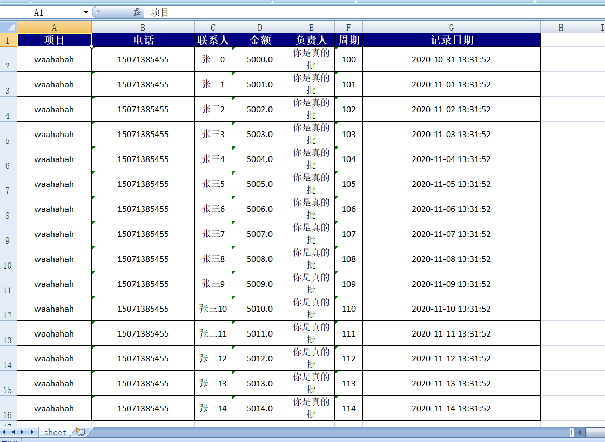

##   `poi-util` 加强`POI`相关操作工具包

### 迭代记录  
+ 2020年11月27日11:33:35 完成Excel导出的部分


### 工具包说明 
| 继承工具类        |            | 完结时间  |
| ------------- |:-------------:| -----:|
| Excel导出      |  |  |
|    |  通用导出`fillCustomer`  |  2020年11月27日11:33:35  |
|   |定制导出  `fillCommon`  |    2020年11月27日11:33:35 |
|Excel 导入  |    |  2020年11月27日17:16:47    |
|   Excel转HTML    |       | 开发中      |
|  WORD模版导出 （convertWord）    |       |    2020年12月2日11:17:49   |
|     |  自动全局调整格式位水平排列     |    2020年12月2日11:17:49   |
|       |  默认按照模板文件样式      |    2020年12月2日11:17:49   |
|  Excel 模版导出     |       |  未开发     |
|       |       |       |

#### 1. 结构说明


#### 2. 使用说明 

    该部分的核心功能是自定义注解，在你需要导出的实体类中，
    将你需要作为表头导出的字段加上自定义注解 @FieldName ，
    注解的属性有value，为Excel表头名称 require是否必填，默认为否
    simpleDate时间格式为，默认为 空  


#### 3. 调用说明
实体类示例 
```java
@Data
public class ProjectVo {

    @FieldName(value = "项目")
    private String name;

    @FieldName(value = "电话")
    private String phone;

    private String person;

    @FieldName(value = "金额")
    private Double money;

    @FieldName(value = "负责人")
    private String processPeople;

    @FieldName(value = "周期")
    private String cycle;

    @FieldName(value = "记录日期",dateFormat = "yyyy-MM-dd")
    private Date date;
}

```

导出功能调用,目前`Excel`导出分两种

 + 通用导出(默认注解value为表头,根据字段值的长度来自适应宽度,全局字体上下左右居中)
 
 + 定制导出 (支持多sheet页导出,支持自定义标题,表头,样式,字体等)
 
 
 ##### 3.1  通用导出`Excel`
 调用方法 
```java
    
    Workbook wb = new XSSFWorkbook();
    //模拟数据
    List<ProjectVo> list = mockData();
    //调用导出方法 
    // 参数说明 wb对象   集合数据  sheetName 默认为sheet
    ExcelExport.getInstance().fillCommon(wb,list,null);
    FileOutputStream out = new FileOutputStream("C:\\Users\\Administrator\\Desktop\\测试导出.xlsx");
    wb.write(out);
    out.close();
```

效果如下 



 ##### 3.2 定制导出`Excel`
```java
    //定制excel
    Workbook wb = new XSSFWorkbook();
    Sheet sheet = wb.createSheet("定制表头导出");
    CellStyle cellStyle = wb.createCellStyle();
    Font font = wb.createFont();
    List<ProjectVo> list = mockData();

    Map<String, List> declaredFieldsInfo = com.adingxiong.poiutils.util.ClassUtils.getDeclaredFieldsInfo(list.get(0));
    int size = declaredFieldsInfo.get(Constants.HEAD).size();
    sheet.addMergedRegion(new CellRangeAddress(0,0,0,size -1 ));
    //主体部分
    Row row = sheet.createRow(0);
    Cell cell = row.createCell(0);
    font.setBold(true);
    font.setFontHeightInPoints((short) 16);
    font.setBoldweight(XSSFFont.BOLDWEIGHT_BOLD);

    CellStyle headStyle = wb.createCellStyle();
    headStyle.setFont(font);
    //设置对齐样式
    headStyle.setAlignment(XSSFCellStyle.ALIGN_CENTER);
    headStyle.setFillForegroundColor(HSSFColor.DARK_RED.index);
    cell.setCellType(1);
    cell.setCellValue("这是定制的单元格头");
    cell.setCellStyle(headStyle);
    
    
    //核心导出部分  前面部分可以自己定制表头,标题,全局样式,多sheet等 
    
    ExcelExport.getInstance().fillCustomer(sheet,1,null,cellStyle,list);
    FileOutputStream out = new FileOutputStream("C:\\Users\\Administrator\\Desktop\\定制导出.xlsx");
    wb.write(out);
    out.close();
```

效果如下所示 


 ##### 3.3  `Excel`导出功能

导入功能还是基于注解部分，会去查找你实体类@Field注解值和Excel表头对应的上的字段，然后将数值对实体类进行数据填充 

实体类注解可以参考导入

方法调用入口`ExcelImport.getInstance().transformation()` ,参数说明 
```java
/**
     * 标题所在行号 默认为 0
     */
    private Integer rowNum = Integer.valueOf(0);

    /**
     * 是否格式话标题  去掉 空格  换行符
     */
    private Boolean formatTitle = Boolean.valueOf(true);

    /**
     * 指定存放错误日志的字段名
     */
    private String fieldError =  null ;

    /**
     * 指定记录表格行数的字段名
     */
    private String fieldRows =  null;
```
可以每个参数都有默认值，不设置即认为是默认。可以通过链式操作来设置各个属性值 
```java
List <ProjectVo> list = ExcelImport.getInstance().setRowNum(5).setFieldRows("rows").isFormatTitle(true).setFieldError("error").transformation(sheet ,ProjectVo.class);
```

导出效果如下所示 


 ##### 3.4  `WORD`模板导出文件  (目前仅支持docx文档  不兼容07版本以下)
 +  支持图片(`http`路径图片资源)
 +  支持多个格式的文本内容
 +  支持纯文本内容  
 +  支持文本 +  列表模式
 
 方法调用入口   `WordExport.getInstance().convertWord(in , resMap , fileName , isDefaultSyle)`
 
 参数说明  
 + `in` 文件直接输入流 ,读取模版文件并转换成`FileInputStream` 
 +` resMap` 需要填充`word`文档的数据,`k-v`形式, `k`必须对应这个模版中的`${}`中的标识
 + `fileName` 导出文件的名称
 + `isDefaultSyle` 是否使用水平样式 这个参数非必要,不传为默认模版样式
 
 
 **模版文件示例**
 
 
 **数据写入效果**
 
 
 
**代码调用**

